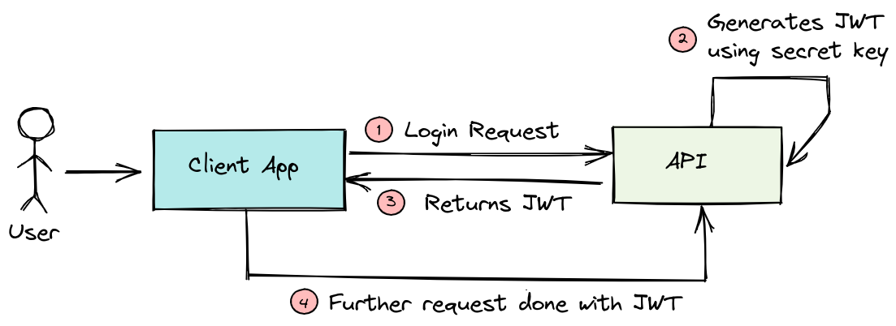

# Integrate AI in health site chatbot

## System Architecture Overview

This document provides an overview of the architecture for our web application, which integrates a chatbot powered by AWS Bedrock.This architecture leverages AWS services to provide a secure, scalable, and efficient environment for deploying a web application with a chatbot. JWT is used for robust user authentication, ensuring that only authorized users can access protected resources.
 
## Components

### 1. Web Application
- **Function**: Serves as the frontend interface for users.
- **Location**: Deployed within Subnet A of the VPC.
- **Security**: Secured with Security Groups (SG) to control inbound and outbound traffic.

### 2. Backend
- **Function**: Manages business logic and processes requests from the Web App and Chatbot.
- **Location**: Deployed within Subnet B of the VPC.
- **Security**: Secured with Security Groups (SG) to control inbound and outbound traffic.

### 3. Chatbot
- **Function**: Provides user interaction and is integrated with AWS Bedrock for AI-driven responses.
- **Location**: Deployed within Subnet A of the VPC.
- **Interaction**: Communicates with AWS Bedrock for processing.

### 4. Database
- **Function**: Stores application data.
- **Location**: Deployed within Subnet B of the VPC.
- **Security**: Secured with Security Groups (SG) to control inbound and outbound traffic.

### 5. AWS Bedrock
- **Function**: Provides AI capabilities to the Chatbot.
- **Interaction**: Receives requests from the Chatbot and sends back processed data.

## User Authentication and JWT Workflow

### Overview
User authentication is handled using JWT. The workflow ensures secure communication and access control between the user, the web application, and the backend services.

### Workflow Steps

1. **Login Request**: The user initiates a login request from the client application (Web App).
2. **JWT Generation**: The backend API verifies the user's credentials and generates a JWT using a secret key.
3. **JWT Return**: The backend API returns the JWT to the client application.
4. **Authenticated Requests**: The client application includes the JWT in the header of subsequent requests to authenticate and access protected resources.

### Detailed Workflow Diagram

1. **User** sends a login request to the **API** via the **Client App**.
2. **API** generates a JWT using a secret key upon successful authentication.
3. **API** returns the JWT to the **Client App**.
4. **Client App** uses the JWT for further requests to access protected endpoints.

## Network Security

- **VPC (Virtual Private Cloud)**: The entire application is deployed within a VPC to ensure isolation and security.
- **Security Groups**: Used to control inbound and outbound traffic to resources within the VPC.
- **Subnets**: The architecture is divided into Subnet A (Web App and Chatbot) and Subnet B (Backend and Database) for better management and security.

## Integration

- **Chatbot and AWS Bedrock**: The chatbot interacts with AWS Bedrock for AI processing, ensuring seamless and intelligent user interactions.
- **Backend and Database**: The backend communicates with the database to store and retrieve data securely.

# Deployment Workflow for AIHealthServer

This repository includes a GitHub Actions workflow for deploying and managing an AWS CloudFormation stack, along with setting up an EC2 instance with a Streamlit application. Follow the steps below to successfully deploy the workflow.

## Prerequisites

1. **AWS Account**: Ensure you have an AWS account with the necessary permissions to create and manage CloudFormation stacks, EC2 instances, and related resources.
2. **GitHub Repository**: This workflow is designed for a GitHub repository. Make sure you have the repository set up.

## Secrets Configuration

You need to configure the following secrets in your GitHub repository for the workflow to work:

1. **AWS Credentials**:
   - **`AWS_ACCESS_KEY_ID`**: Your AWS access key ID.
   - **`AWS_SECRET_ACCESS_KEY`**: Your AWS secret access key.

   To create these secrets, follow these steps:
   - Go to your GitHub repository.
   - Navigate to `Settings` > `Secrets and variables` > `Actions`.
   - Click on `New repository secret`.
   - Add `AWS_ACCESS_KEY_ID` and `AWS_SECRET_ACCESS_KEY` with your respective values.

2. **SSH Private Key**:
   - **`SSH_PRIVATE_KEY`**: Your SSH private key for accessing the EC2 instance.

   To create this secret:
   - Generate an SSH key pair if you don't have one using `ssh-keygen`.
   - Add the private key (e.g., `id_rsa`) to the repository secrets as `SSH_PRIVATE_KEY`.

3. **CloudFormation Parameters**:
   - **`AMI`**: The AMI ID for the EC2 instance.
   - **`AMIBackend`**: The AMI ID for the backend instance.
   - **`DBUsername`**: The database username.
   - **`DBPassword`**: The database password.

   Add these parameters as secrets in the same way as the AWS credentials.

## Workflow Overview

The workflow will:

- Validate the CloudFormation template.
- Check if the CloudFormation stack exists.
- Create or update the CloudFormation stack.
- Wait for the EC2 instance to be ready.
- Retrieve the EC2 instance's public IP.
- Transfer files to the EC2 instance.
- Deploy and run the Streamlit application on the EC2 instance.
- Delete the CloudFormation stack if specified.

## Deployment Commands

To deploy the workflow:

1. **Push to Main Branch**: The workflow triggers on `push` to the `main` branch. Simply pushing changes to this branch will start the deployment process.

2. **Create a Pull Request**: Alternatively, the workflow will also trigger on a pull request to the `main` branch.

## Deployable Components

The workflow deploys:

- A CloudFormation stack with resources defined in `server-deployment/server.yaml`.
- An EC2 instance configured with the provided AMI.
- HTML and other application files to the EC2 instance.
- A Streamlit application configured and started on the EC2 instance.

## Notes

- Make sure your CloudFormation template and application files are correctly configured and available in the repository.
- Regularly review and update your secrets and security practices.
- Monitor the workflow runs in GitHub Actions to track the deployment status and handle any issues.

## Resources Deployed by CloudFormation

- **VPC**: Virtual Private Cloud.
- **Subnets**:
  - Public:
  - Private
- **EC2 Instances**:
  - Main EC2 Instance in `AiHealthPublicSubnet1`.
  - Backend EC2 Instance in `AiHealthPublicSubnet2`.
- **Security Groups**: For EC2 instances allowing SSH (port 22), HTTP (port 80), HTTPS (port 443), and custom port 8501.
- **IAM Role and Instance Profile**: For EC2 instances.

## Outputs

- **VPCId**: ID of the created VPC.
- **PublicSubnetId1**: ID of the first public subnet.
- **PublicSubnetId2**: ID of the second public subnet.
- **PrivateSubnetId1**: ID of the first private subnet.
- **PrivateSubnetId2**: ID of the second private subnet.
- **InstanceId**: ID of the main EC2 instance.
- **BackendInstanceId**: ID of the backend EC2 instance.

## Optional

- **RDS Instance**: Not included by default. Uncomment the relevant sections in the template to deploy an RDS instance.
